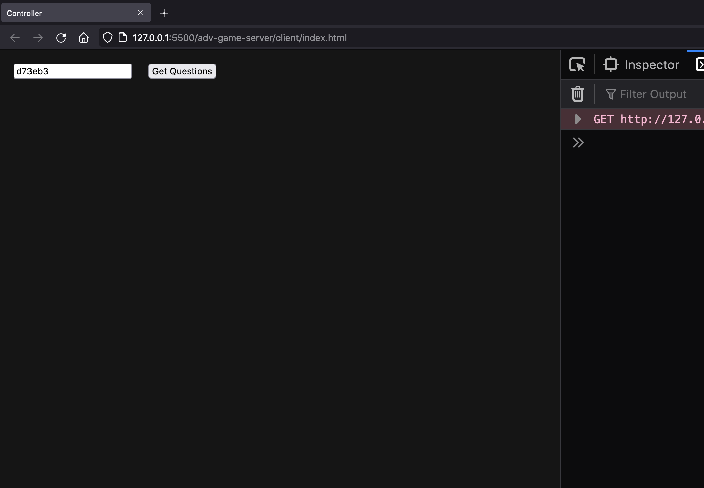
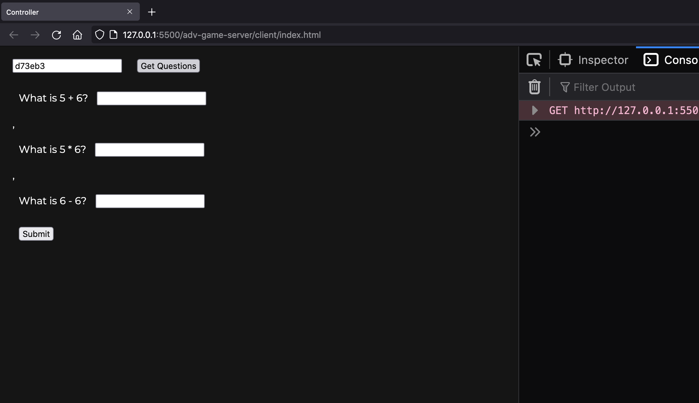

# Answers
## How to get started
Read this first half of the readme first. (second half after the cats is the solution so if you want to try it yourself first, dont look down there yet)

Download this folder (with client and server folder)

navigate to the **/server folder** in the terminal

if you have node installed already, you can type
```bash
npm install
```
to install all the dependencies

(hopefully you've also installed nodemon so you can start the server by just typing `nodemon` in the terminal)

otherwise, you're going to type
```bash
node script.js
```
Now the terminal should be runnning on port 5000. (won't print anythign oops i forgot. but it will print when someone makes a request)

Now, you need to open up the index.html file inside the client folder in the browser. It should look (and work) like the section below.


## How it works: 
(ignore the url, i hosted my website on a live server but you can just access it by double clicking index.html)
### When you open up the site, it should prompt you for a question set code (given to you by teacher)


### After you input code, it should give you questions


### After filling out questions and clicking submit, it should give you a score


## What to do
If you run it right now, it'll work.. but not correctly

Look at `server/script.js` line 31 and 44. These are the 2 routes you'll be working on. They should have TODO's that will tell you what they should do. IF you get stuck, scroll down to the bottom of the readme for an example of a solution.

Once you've done that, think about how you can create a new route for teachers to create their own question set. lmk if u need some direction on how to do that

spoilers below. cats are here to prevent accidental peeking


```js
app.get('/get-questions/:code', function (req, res) {
    // get question set for a specific code
    var questionSet = completeQuestionSet[req.params.code]; 

    // // will return the question set but only question item (i.e. without answer)
    var onlyQuestions = questionSet.map((item) => item.question);

	res.send(onlyQuestions);
});


app.post('/check-answers/:code', function (req, res) {
	var code = req.params.code;
	var answers = req.body.answers;

	var score = 0;

    // loop and check if the user answer matches the question set answer
	for(let i = 0; i < answers.length; i++){
		if(answers[i] == completeQuestionSet[code][i].answer) score++;
	}

	res.send({ score: score });
});
```