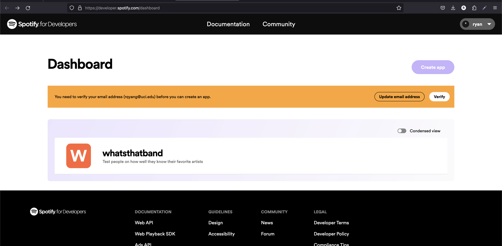
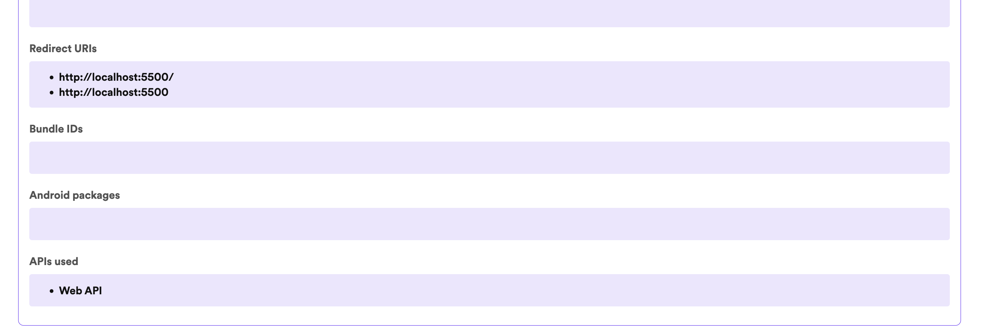

# Spotify Sample Code

This is the repo for a basic implementation of the Spotify API. You can follow the guide here: [https://developer.spotify.com/documentation/web-api](https://developer.spotify.com/documentation/web-api)

## Directions

As per the guide above,

Go to the dev dashboard [https://developer.spotify.com/dashboard](https://developer.spotify.com/dashboard)

Make sure you've configured your settings correctly

