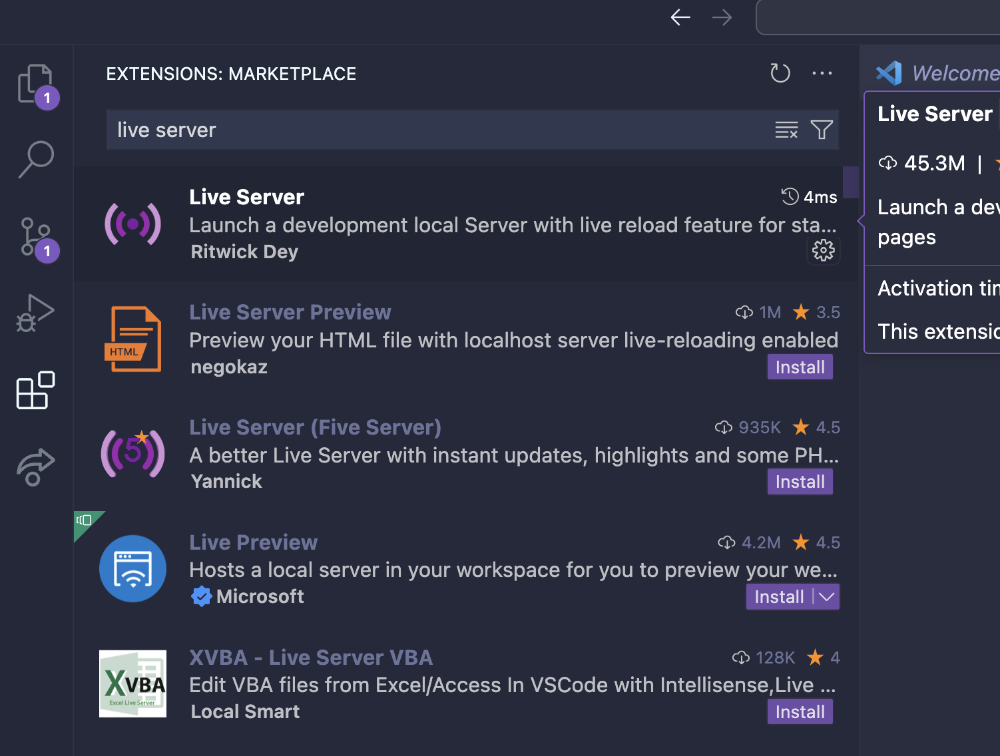
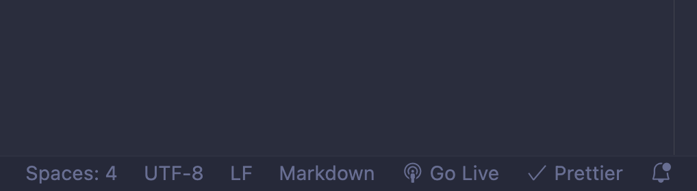

## To run the frontend

two ways: either

1. double click the index.html
2. install live server
   
   and then click "go live" on the bottom of your screen
   

## to run the backend

1. install all packages. should be able to follow [these instructions](https://packaging.python.org/en/latest/tutorials/installing-packages/)
2. run `python -m flask run` (make sure you name your main function file `app.py`)
